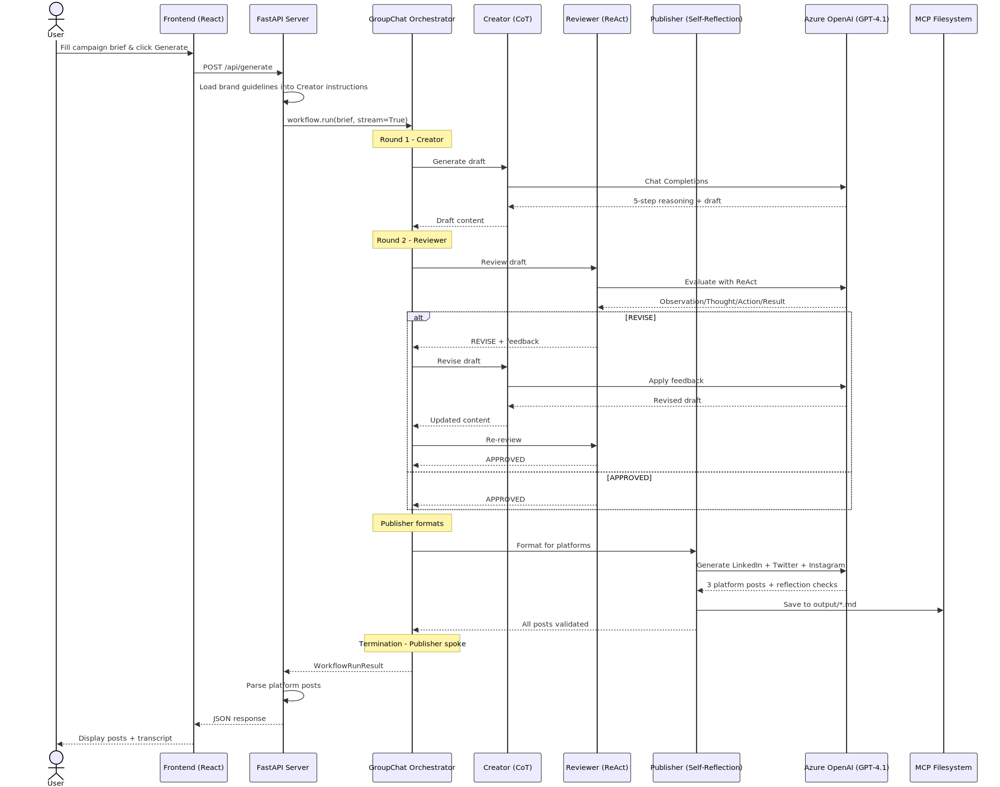

# 🧠 Zava Travel Inc. — Multi-Agent Social Media Content Creator

**Track**: Reasoning Agents with Microsoft Foundry | **Hackathon**: Agents League @ TechConnect

> Three AI agents collaborate in a group chat to generate, review, and publish platform-ready social media content for Zava Travel Inc.

---

## 🏗️ Architecture

```
Campaign Brief (User Input)
        │
        ▼
┌─────────────────────────────────────────────────┐
│         GROUP CHAT ORCHESTRATOR                  │
│         (Round-Robin Speaker Selection)          │
│                                                  │
│   Creator → Reviewer → Creator → Reviewer → Publisher
└─────────────────────────────────────────────────┘
     │              │              │
     ▼              ▼              ▼
┌──────────┐ ┌──────────┐ ┌──────────┐
│ CREATOR  │ │ REVIEWER │ │PUBLISHER │
│(Azure AI)│ │(Copilot) │ │(Azure AI)│
│          │ │          │ │          │
│ Chain-of │ │  ReAct   │ │  Self-   │
│ Thought  │ │ Pattern  │ │Reflection│
└──────────┘ └──────────┘ └──────────┘
                                │
                                ▼
                    3 Platform-Ready Posts
                  (LinkedIn, Twitter, Instagram)
```

### System Architecture



### Data Flow (Content Generation)



| Component       | Engine                  | Reasoning Pattern                       | Role                                                     |
| --------------- | ----------------------- | --------------------------------------- | -------------------------------------------------------- |
| **Orchestrator** | Agent Framework GroupChat | Router (inspect state → decide → dispatch) | Routes conversation flow with intelligent fast-tracking |
| **Creator**     | Azure OpenAI (GPT-5.x) | Chain-of-Thought (5 steps)              | Drafts content with visible reasoning                    |
| **Reviewer**    | GitHub Copilot SDK      | ReAct (Observe → Think → Act → Result)  | Reviews brand alignment & quality                        |
| **Publisher**   | Azure OpenAI (GPT-5.x) | Self-Reflection (validate constraints)  | Formats for LinkedIn, Twitter, Instagram                 |

---

## 🚀 Quick Start

### Prerequisites

- Python 3.10+
- Node.js 18+ and npm (for MCP filesystem server + frontend)
- Azure Subscription with AI Foundry project & deployed reasoning model
- Azure CLI (`az login`)
- GitHub Copilot CLI (authenticated with `/login`)

### Setup

```powershell
# 1. Create virtual environment
python -m venv venv
.\venv\Scripts\Activate.ps1

# 2. Install Python dependencies
pip install --pre -r requirements.txt

# 3. Install MCP filesystem server
npm install -g @modelcontextprotocol/server-filesystem
# Optional: only needed if using MCP_TRANSPORT=streamable-http
# npm install -g supergateway

# 4. Install frontend dependencies
cd frontend
npm install
cd ..

# 5. Configure environment
copy .env.sample .env
# Edit .env with your Azure endpoints

# 6. Authenticate
az login
```

### Running the Application

You can run the workflow in two ways:

#### Option A: Full Stack (frontend + API server)

Open **two terminals**:

**Terminal 1 — Backend API server** (port 8000):

```powershell
.\venv\Scripts\Activate.ps1
python api_server.py
# API available at http://localhost:8000
# Health check: GET http://localhost:8000/api/health
```

**Terminal 2 — Frontend dev server** (port 5173):

```powershell
cd frontend
npm run dev
# Open http://localhost:5173 in your browser
```

Then open http://localhost:5173, log in with a demo account, and click **Generate Content**.

#### Option B: CLI Only (no frontend)

```powershell
python workflow_social_media.py
```

Output is printed to the console and saved to `./output/social-posts-*.md`.

#### Demo Accounts

| Username           | Password     | Role                 |
| ------------------ | ------------ | -------------------- |
| `sarah.explorer`   | `zava2026`   | Content Lead         |
| `marco.adventures` | `wander2026` | Social Media Manager |
| `admin`            | `admin`      | Administrator        |

### API Endpoints

| Method | Path            | Description                                  |
| ------ | --------------- | -------------------------------------------- |
| `GET`  | `/api/health`   | Health check — returns `{"status": "ok"}`    |
| `POST` | `/api/generate` | Run multi-agent workflow with campaign brief |

**POST `/api/generate`** request body:

```json
{
  "brand_name": "Zava Travel Inc.",
  "industry": "Travel — Budget-Friendly Adventure",
  "target_audience": "Millennials & Gen-Z adventure seekers",
  "key_message": "Wander More, Spend Less — affordable curated itineraries starting at $699",
  "destinations": "Bali, Patagonia, Iceland, Vietnam, Costa Rica",
  "platforms": ["LinkedIn", "Twitter", "Instagram"]
}
```

**Response** (JSON):

```json
{
  "status": "success",
  "posts": { "linkedin": "...", "twitter": "...", "instagram": "..." },
  "transcript": [
    {
      "agent_name": "Creator",
      "content": "...",
      "reasoning_pattern": "Chain-of-Thought",
      "timestamp": "..."
    }
  ],
  "duration_seconds": 42.5,
  "termination_reason": "Reviewer approved — fast-tracked to Publisher"
}
```

### Environment Variables (`.env`)

```env
AZURE_AI_FOUNDRY_PROJECT_ENDPOINT=https://<resource>.services.ai.azure.com/api/projects/<project>
AZURE_OPENAI_ENDPOINT=https://<resource>.services.ai.azure.com
AZURE_OPENAI_CHAT_DEPLOYMENT_NAME=<your-deployed-model>
MCP_TRANSPORT=stdio                    # Optional — 'stdio' (default) or 'streamable-http'
MCP_SERVER_PORT=8001                   # Optional — supergateway port (only for streamable-http)
```

---

## 🧪 Running Automated Tests

The project includes comprehensive Playwright automated tests for the frontend application. All 84 functional test cases have been implemented covering login, dashboard, campaign creation, and content generation workflows.

### Prerequisites

- **Node.js 18+** installed
- **Chrome browser** installed (required by Playwright)
- Frontend application configured with `WEBSITE_ENTRY_POINT` in `.env`

### Setup & Run Tests

```powershell
# Navigate to test directory
cd FunctionalTestCases

# Install dependencies (first time only)
npm install

# Install Playwright browsers (first time only)
npx playwright install chromium

# Run all tests
npm test

# Run specific test suite
npm run test:us001  # Login tests (15 tests)
npm run test:us002  # Dashboard tests
# ... etc

# Run tests with visible browser (headed mode)
npm test -- --headed

# Run tests in UI mode (interactive debugging)
npm run test:ui

# View HTML report
npm run report
```

### Test Coverage

- ✅ **15 Login tests** - Authentication, demo accounts, form validation
- ✅ **6 Dashboard tests** - Hero section, statistics, agent team display
- ✅ **12 Campaign Brief tests** - Form display, editing, submission
- ✅ **5 Agent Collaboration tests** - Loading states, progress tracking
- ✅ **7 Generated Posts tests** - Content display, character counts
- ✅ **8 Copy to Clipboard tests** - All platforms, content preservation
- ✅ **7 Agent Transcript tests** - Message display, formatting
- ✅ **9 Navigation tests** - Sidebar, routing, active states
- ✅ **8 Logout tests** - Session management, security
- ✅ **7 Empty State tests** - Initial state, transitions

**Total**: 84 automated functional tests

For detailed test documentation, see [FunctionalTestCases/README.md](FunctionalTestCases/README.md)

---

## 📋 Demo Campaign

The default campaign showcases Zava Travel's **"Wander More, Spend Less"** summer adventure:

| Attribute        | Value                                                     |
| ---------------- | --------------------------------------------------------- |
| **Company**      | Zava Travel Inc. (zavatravel.com)                         |
| **Industry**     | Budget-friendly adventure travel                          |
| **Audience**     | Millennials & Gen-Z adventure seekers                     |
| **Tone**         | Adventurous & Inspiring                                   |
| **Destinations** | Bali, Patagonia, Iceland, Vietnam, Costa Rica             |
| **Hashtags**     | #ZavaTravel #WanderMore #AdventureAwaits #TravelOnABudget |

### Example Output

The system produces three platform-ready posts:

- **LinkedIn**: Professional-adventurous, 1-3 paragraphs, 3-5 hashtags
- **X/Twitter**: Under 280 characters, punchy, 2-3 hashtags
- **Instagram**: Visual-friendly, emojis, 5-10 hashtags, image suggestions

---

## 📁 Project Structure

```
├── api_server.py                   # FastAPI backend (POST /api/generate)
├── workflow_social_media.py        # CLI entry point
├── frontend/                       # React + Vite + Fluent UI frontend
│   ├── src/
│   │   ├── pages/CreateContentPage.tsx   # Campaign brief form + results display
│   │   ├── pages/DashboardPage.tsx       # Dashboard with agent info
│   │   ├── services/api.ts              # API client (calls /api/generate)
│   │   └── context/AuthContext.tsx       # Demo authentication
│   └── package.json
├── agents/
│   ├── creator.py                  # Chain-of-Thought agent instructions
│   ├── reviewer.py                 # ReAct agent instructions
│   └── publisher.py                # Self-Reflection agent instructions
├── orchestration/
│   ├── speaker_selection.py        # Round-robin + fast-track logic
│   └── termination.py              # 3 termination conditions
├── grounding/
│   ├── file_search.py              # Brand guidelines grounding (embedded in instructions)
│   └── brand-guidelines.md         # Zava Travel brand guidelines
├── monitoring/
│   ├── tracing.py                  # OpenTelemetry + Azure Monitor setup
│   ├── pii_middleware.py           # PII scrubbing SpanProcessor
│   └── agent_middleware.py         # Per-agent telemetry child spans
├── evaluation/
│   ├── agent_runner.py             # Runs workflow for each test brief
│   ├── evaluate.py                 # 5 evaluators + report generation
│   └── eval_dataset.jsonl          # 3 campaign brief test cases
├── safety/
│   ├── content_shield.py           # Two-layer shield (Azure CS + brand filters)
│   └── brand_filters.py            # Local regex filters (competitors, banned words, PII, jailbreak)
├── tools/
│   └── filesystem_mcp.py           # MCP filesystem (stdio + optional HTTP Streamable)
├── utils/
│   ├── formatting.py               # Platform validation
│   ├── transcript_formatter.py     # Conversation display
│   └── markdown_formatter.py       # Export to markdown
├── config/
│   └── env_loader.py               # Environment validation
├── test-data/                      # Synthetic test data
│   ├── campaign-briefs/            # 5 campaign brief inputs
│   ├── expected-outputs/           # Golden reference posts
│   ├── grounding/                  # Brand guidelines document
│   ├── safety-tests/               # 16 content safety test cases
│   ├── evaluation-baselines/       # Quality score thresholds
│   └── edge-cases/                 # 8 edge case inputs
├── output/                         # Generated posts saved here
├── .env.sample                     # Environment template
├── requirements.txt                # Python dependencies
└── constitution.md                 # Project governing principles
```

---

## 🧠 Reasoning Patterns

### Creator — Chain-of-Thought

```
Step 1: Identify the campaign objective
Step 2: Consider audience interests and pain points
Step 3: Draft an attention-grabbing hook
Step 4: Build the body with value and destination highlights
Step 5: Close with a clear call-to-action
```

### Reviewer — ReAct

```
Observation: The draft uses "cheap travel" language
Thought:    Zava's brand voice is "adventurous & inspiring" — should feel empowering
Action:     Recommend replacing "cheap" with "budget-savvy adventure"
Result:     Revised draft maintains aspirational tone while communicating value
```

### Publisher — Self-Reflection

```
Draft:  [formatted LinkedIn post]
Check:  Professional-adventurous tone? ✓
Check:  3-5 hashtags including #ZavaTravel? ✓
Check:  CTA with zavatravel.com? ✓
Final:  [polished post ready for publication]
```

---

## � Agentic Evaluation

The project includes a full evaluation pipeline using the **Azure AI Evaluation SDK** to measure content quality across multiple dimensions.

### Evaluators

| #   | Evaluator                  | Type       | What It Measures                                                  | Scale          |
| --- | -------------------------- | ---------- | ----------------------------------------------------------------- | -------------- |
| 1   | **TaskAdherenceEvaluator** | Built-in   | Did agents follow their instructions and produce expected output? | Binary (Pass/Fail) |
| 2   | **CoherenceEvaluator**     | Built-in   | Is the output natural, well-written, and logically structured?    | 1–5            |
| 3   | **RelevanceEvaluator**     | Built-in   | Does the output address the campaign brief?                       | 1–5            |
| 4   | **GroundednessEvaluator**  | Built-in   | Is content grounded in the brand guidelines?                      | 1–5            |
| 5   | **PlatformComplianceEvaluator** | Custom code | Twitter ≤280 chars, Instagram has emojis/hashtags, no banned words | 1–5        |

### Test Dataset

Three campaign briefs in `evaluation/eval_dataset.jsonl`:

| ID     | Brief                                           |
| ------ | ----------------------------------------------- |
| CB-001 | Summer Adventure Campaign (5 destinations)      |
| CB-002 | Vietnam Itinerary Launch (Hanoi → HCMC)         |
| CB-003 | 48-Hour Flash Sale on Bali (30% off)            |

### Running Evaluation

```powershell
# Step 1 — Generate agent responses for each test brief
$env:PYTHONIOENCODING="utf-8"
.\venv\Scripts\python.exe evaluation/agent_runner.py

# Step 2 — Run evaluators and produce report
.\venv\Scripts\python.exe evaluation/evaluate.py
```

Results are saved to `evaluation/eval_report.json` with per-row scores and aggregate metrics.

### Latest Results

| Evaluator            | Score          |
| -------------------- | -------------- |
| Task Adherence       | PASS ✅        |
| Coherence            | 4.67 / 5       |
| Groundedness         | 5.0 / 5        |
| Relevance            | 5.0 / 5        |
| Platform Compliance  | 4.47 / 5       |

---

## 📡 Monitoring & Observability

Full distributed tracing with **OpenTelemetry** + **Azure Monitor** (Application Insights). Every workflow run, agent turn, and API call is captured as a trace.

### Components

| Module                  | File                          | Purpose                                                      |
| ----------------------- | ----------------------------- | ------------------------------------------------------------ |
| **Tracing Setup**       | `monitoring/tracing.py`       | Configures Azure Monitor exporter, enables auto-instrumentation (FastAPI, requests, httpx, azure_sdk), gracefully degrades if not configured |
| **PII Scrubber**        | `monitoring/pii_middleware.py`| OpenTelemetry `SpanProcessor` that scrubs PII from span attributes before export |
| **Agent Telemetry**     | `monitoring/agent_middleware.py` | Creates per-agent child spans with turn duration, char counts, token estimates, and reasoning pattern labels |

### PII Patterns Scrubbed

| Pattern            | Example Input                     | Redacted As          |
| ------------------ | --------------------------------- | -------------------- |
| Email addresses    | `user@example.com`                | `[EMAIL_REDACTED]`   |
| Phone numbers      | `+1-555-123-4567`                 | `[PHONE_REDACTED]`   |
| Credit card numbers| `4111-1111-1111-1111`             | `[CC_REDACTED]`      |
| IPv4 addresses     | `192.168.1.1`                     | `[IP_REDACTED]`      |
| Bearer/API tokens  | `Bearer sk-abc123...`             | `Bearer [TOKEN_REDACTED]` |

### Per-Agent Span Attributes

Each agent turn creates a child span under the workflow root span with:

- `agent.name` — Creator, Reviewer, Publisher, or Orchestrator
- `agent.reasoning_pattern` — Chain-of-Thought, ReAct, Self-Reflection, or GroupChat
- `agent.turn_index` — Sequential turn number (1, 2, 3, …)
- `agent.output_chars` — Character count of the agent's response
- `agent.estimated_output_tokens` — Approximate token estimate (chars ÷ 4)
- `agent.turn_duration_ms` — Wall-clock time for the turn in milliseconds

### Setup

1. **Create an Application Insights resource** in Azure Portal
2. **Copy the connection string** and add it to `.env`:

```env
APPLICATIONINSIGHTS_CONNECTION_STRING=InstrumentationKey=<key>;IngestionEndpoint=https://<region>.in.applicationinsights.azure.com/;...
```

3. **Install dependencies** (already in `requirements.txt`):

```powershell
pip install azure-monitor-opentelemetry opentelemetry-api opentelemetry-sdk
```

4. **Run the workflow** — tracing activates automatically:

```powershell
$env:PYTHONIOENCODING="utf-8"
.\venv\Scripts\python.exe workflow_social_media.py
# Output: 🛡️ PII scrubbing middleware attached to trace pipeline
#         ✅ Observability enabled — traces → Application Insights
```

5. **View traces** in Azure Portal → Application Insights → Transaction Search → End-to-end tracing

### Graceful Degradation

If `APPLICATIONINSIGHTS_CONNECTION_STRING` is not set or `azure-monitor-opentelemetry` is not installed, the workflow runs normally without tracing — no errors, no side effects.

---
## 🛡️ Content Safety

Two-layer content safety shield that screens both **input** (campaign briefs) and **output** (agent-generated content) before it reaches the user.

### Architecture

```
User Brief ──► [INPUT SHIELD] ──► Agents ──► [OUTPUT SHIELD] ──► Response
                 │                              │
                 ├─ Azure Content Safety         ├─ Azure Content Safety
                 │   (Hate/Violence/Sexual/      │   (Hate/Violence/Sexual/
                 │    Self-Harm)                  │    Self-Harm)
                 └─ Jailbreak Detection          ├─ Competitor Mentions
                                                 ├─ Banned Word Filter
                                                 ├─ Unsafe Activity Filter
                                                 └─ PII Detection
```

### Layer 1 — Azure AI Content Safety (Cloud)

Uses the `azure-ai-contentsafety` SDK to screen text against 4 harm categories:

| Category  | Blocks At       | Warns At       |
| --------- | --------------- | -------------- |
| Hate      | Severity ≥ 4/6  | Severity ≥ 2/6 |
| Violence  | Severity ≥ 4/6  | Severity ≥ 2/6 |
| Sexual    | Severity ≥ 4/6  | Severity ≥ 2/6 |
| Self-Harm | Severity ≥ 4/6  | Severity ≥ 2/6 |

Gracefully degrades if `CONTENT_SAFETY_ENDPOINT` is not configured — brand filters still run.

### Layer 2 — Brand-Specific Filters (Local)

Pure-Python regex filters — no cloud dependency, always active:

| Filter              | Severity  | What It Catches                                                 |
| ------------------- | --------- | --------------------------------------------------------------- |
| Competitor mentions  | 🔴 Block | VoyageNow, CookTravel, WanderPath                              |
| Banned words         | 🟡 Warn  | "cheap", "tourist", "package deal", "discount", "basic" (with suggestions) |
| Unsafe activities    | 🔴 Block | Dangerous without safety gear, binge drinking, cultural insensitivity |
| PII in content       | 🔴 Block | Email addresses, phone numbers, SSN-like patterns               |
| Jailbreak detection  | 🔴 Block | "Ignore previous instructions", DAN mode, system prompt injection |

### Setup

1. **(Optional)** Create an Azure AI Content Safety resource and add to `.env`:

```env
CONTENT_SAFETY_ENDPOINT=https://<resource>.cognitiveservices.azure.com
# CONTENT_SAFETY_KEY=<key>  # Or use DefaultAzureCredential (recommended)
```

2. Brand filters work out of the box — no configuration needed.

### Integration Points

- **CLI workflow** (`workflow_social_media.py`): Screens campaign brief before agents run + screens publisher output before saving
- **API server** (`api_server.py`): `POST /api/generate` screens input (returns `400` if blocked) + screens output (adds `safety` field to response)

### API Response — Safety Field

```json
{
  "status": "success",
  "posts": { ... },
  "safety": {
    "status": "passed",
    "flags": []
  }
}
```

Possible `safety.status` values: `"passed"`, `"warnings"`, `"blocked"`.

### Test Results

Validated against all 16 project safety test cases — **25/25 filter tests passed**.

---
## �🔒 Security

- ✅ `DefaultAzureCredential` — no hardcoded API keys
- ✅ `.env` excluded via `.gitignore`
- ✅ `.env.sample` with placeholders only
- ✅ No PII, customer data, or confidential content
- ✅ All Azure resource names parameterized

---

## 🎯 Hackathon Milestones

| #   | Milestone                                            | Status |
| --- | ---------------------------------------------------- | ------ |
| 1   | Environment setup (Foundry + model deployment)       | ✅     |
| 2   | Agent creation (Creator, Reviewer, Publisher)        | ✅     |
| 3   | Grounding knowledge (File Search + brand guidelines) | ✅     |
| 4   | External tools (MCP filesystem integration)          | ✅     |

### Bonus Features (Optional)

| Feature            | Package                       | Status   |
| ------------------ | ----------------------------- | -------- |
| Observability      | `azure-monitor-opentelemetry` | ✅ Done  |
| Content Safety     | `azure-ai-contentsafety`      | ✅ Done  |
| Agentic Evaluation | `azure-ai-evaluation`         | ✅ Done  |

---

## � ## MCP Filesystem Integration

The Publisher agent saves posts to `./output/` via the [Model Context Protocol](https://modelcontextprotocol.io) using `@modelcontextprotocol/server-filesystem`.

### Transport Modes

Set `MCP_TRANSPORT` in `.env` to choose (default: `stdio`):

| Mode                | Env Value         | How It Works                                                                                                        |
| ------------------- | ----------------- | ------------------------------------------------------------------------------------------------------------------- |
| **Stdio** (default) | `stdio`           | Direct stdio pipe to the MCP server. Simplest setup.                                                                |
| **HTTP Streamable** | `streamable-http` | Uses [supergateway](https://github.com/nichochar/supergateway) as a bridge. Requires `npm install -g supergateway`. |

```
# Stdio (default)
Publisher Agent -> MCPStdioTool -> npx server-filesystem ./output

# HTTP Streamable (opt-in)
Publisher Agent -> MCPStreamableHTTPTool -> http://127.0.0.1:8000/mcp
                                              | supergateway
                                              v
                                       npx server-filesystem ./output
```

| Setting          | Default    | Override                                      |
| ---------------- | ---------- | --------------------------------------------- |
| Transport        | `stdio`    | `MCP_TRANSPORT` env var                       |
| Port (HTTP only) | `8000`     | `MCP_SERVER_PORT` env var                     |
| Output dir       | `./output` | Pass `output_dir` to `get_filesystem_tools()` |

---

## Resources

- [Microsoft Foundry Documentation](https://learn.microsoft.com/azure/ai-foundry/)
- [Microsoft Agent Framework](https://github.com/microsoft/agent-framework)
- [GitHub Copilot SDK](https://github.com/github/copilot-sdk)
- [Starter Code Repository](https://github.com/sureshpaulraj/aiagent-maf-githubcopilotsdk)

---

⚠️ **Security Notice**: This is a PUBLIC repository. See [DISCLAIMER.md](DISCLAIMER.md) for guidelines. See also the [original hackathon README](README_OLD.md) for competition rules.

**Good luck! Wander More, Spend Less 🌍✈️**
